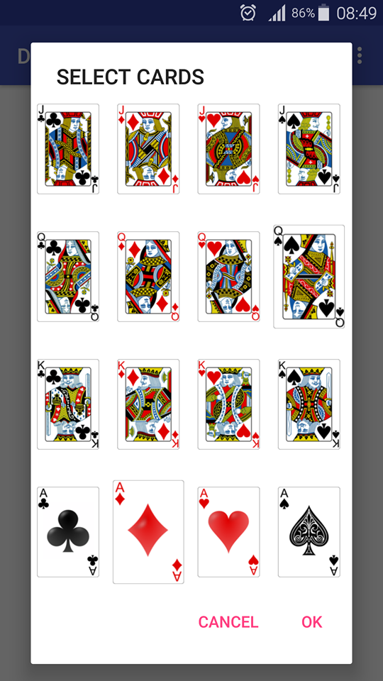
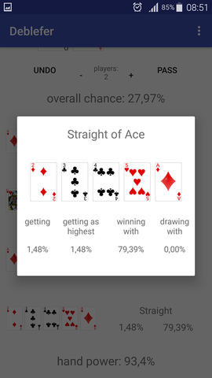
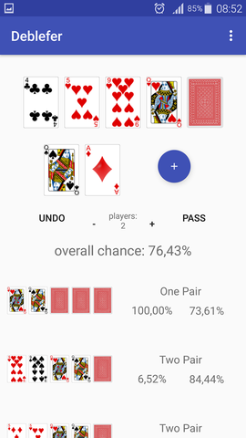

# Deblefer

Deblefer is an app designed to help Texas Hold'em players to estimate their hand power and hence chance of winning. It gives accurate probabilities for specific hand values and introduce them in clear modern manner. It's designed to be user friendly, highly responsive and helpful.

Here are some screenshots:

You can download apk [here](App/app/release/app-release.apk).